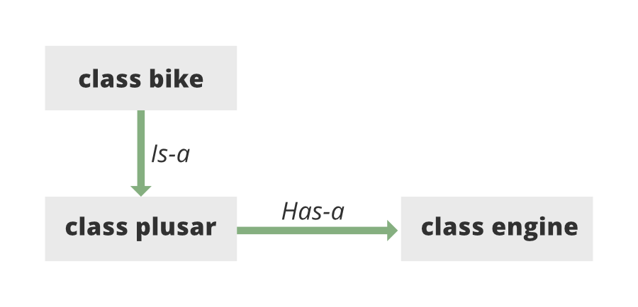
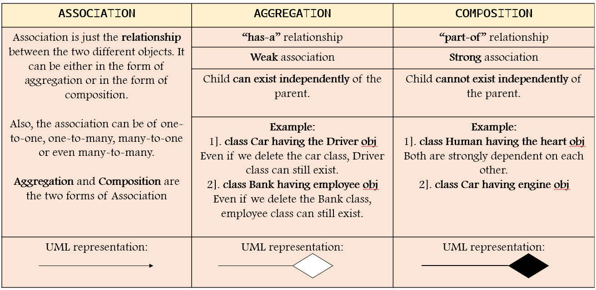
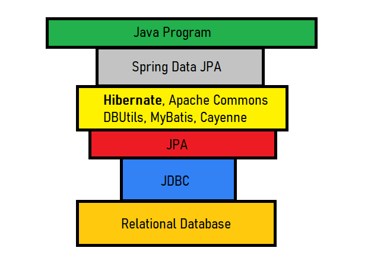
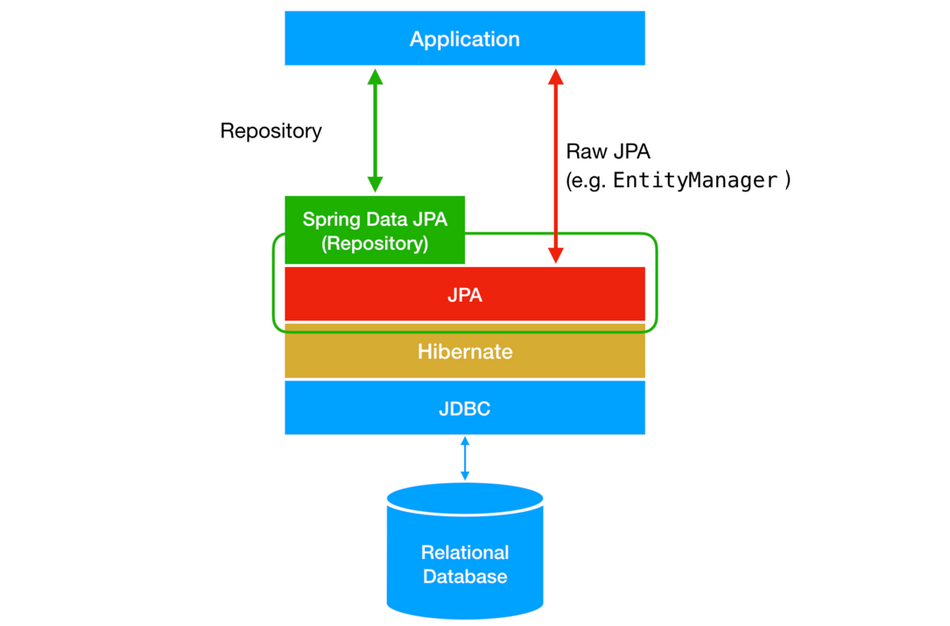
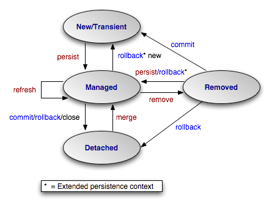
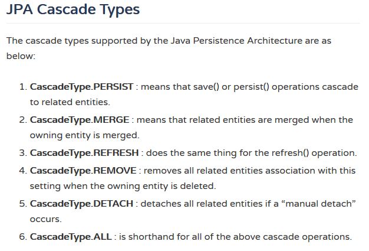

### Relations between entities

There can be 2 types of relationships :
1. X -> A : IS-A = Inheritance
2. Y -> A : HAS-A = Association
Eg:

Association - are of 2 types
1. Aggregation
2. Association

## Spring data JPA

Lets see how JPA is used:

#### ORM
Object relation mapping: is a method of querying and manipulating data from database using Object Oriented Programming language.

By large using this method , we are able to interact with relational database without using SQL.

**Java persistent API (JPA)** : started in May 2006 is a Java application that deals with persistent data in Java applications.

Most common Java ORM is **Hibernate**

Hibernate implements the standard version of JPA. 

>In short the main difference between JPA and Hibernate is : Hibernate is a framework, where JPA is API specification focussed on ORM.

### What is JPA ?
For almost all applications where we need to persist data in some Db and retrieving and storing large amount of data.
So to retrieve the burden on app developers interacting with Db -JPA is excellent option.

#### Entities
Are the real tables

#### JPA Hibernate Cascade Types

Q. What is Cascading ?

Ans : Entity relationships often depend on the existence of another entity, 
    for example the Person–Address relationship. 
    Without the Person, the Address entity doesn’t have any meaning of its own. 
    When we delete the Person entity, our Address entity should also get deleted.

> Cascading is the way to achieve this. 
> When we perform some action on the target entity, the same action will be applied to the associated entity.

##### JPA Cascade Type:
1. ALL
2. PERSIST
3. MERGE
4. REMOVE
5. REFRESH
6. DETACH

When we have a relationship between 2 entities and we want to 
##### Hibernate Cascade Types:

Hibernate supports three additional Cascade Types along with those specified by JPA.
These Hibernate-specific Cascade Types are available in org.hibernate.annotations.CascadeType:
1. REPLICATE
2. SAVE_UPDATE
3. LOCK

#### CascadeType.ALL

