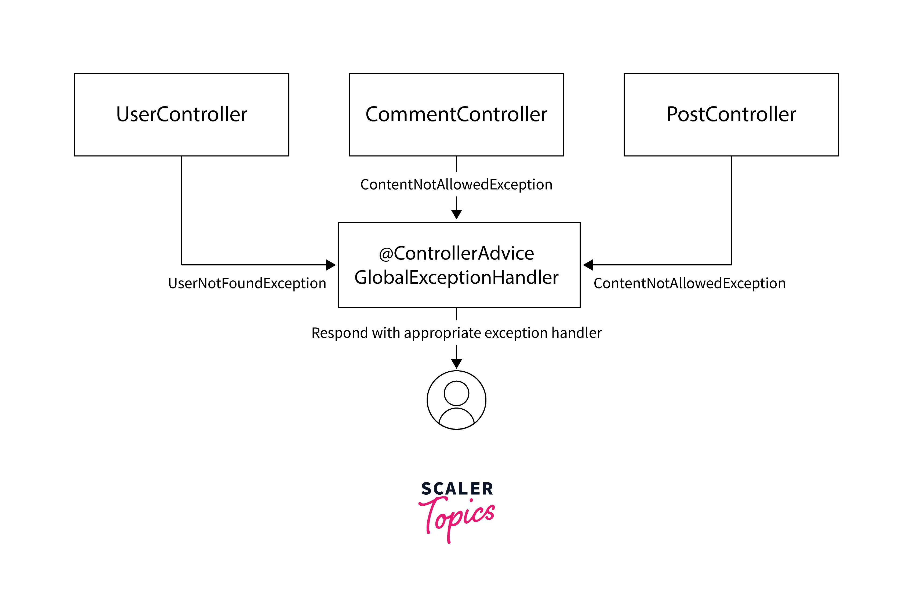

Product Service:
Has Models:  Products and category

Return Type of Service ? Can service return models -> still okay, **but controllers can't return models**
After version 1:

Service -> Model -> Controllers -> Dtos
meaning service can send Models as response to Controllers but controller should be sending out DTO's only to client

@ControllerAdvice : is used to handle exceptions on the global level

## Hibernate Inheritance

**Relational database**s don’t have a straightforward way to map class hierarchies onto database tables.

To address this, the JPA specification provides several strategies:

1. **MappedSuperclass** – the parent classes, can’t be entities
2. **Single Table** – The entities from different classes with a common ancestor are placed in a single table.
3. **Joined Table** – Each class has its table, and querying a subclass entity requires joining the tables.
4. Table per Class – All the properties of a class are in its table, so no join is required.

> Each strategy results in a different database structure.

**Entity inheritance means that we can use polymorphic queries for retrieving all the subclass entities when querying for a superclass.**

Since Hibernate is a JPA implementation, it contains all of the above as well as a few Hibernate-specific features related to inheritance.

#### Mapped Superclass

Using the MappedSuperclass strategy, inheritance is only evident in the class but not the entity model.

Let’s start by creating a Person class that will represent a parent class:
`@MappedSuperclass
public class Person {
    @Id
    private long personId;
    private String name;
    // constructor, getters, setters
}`

This class no longer has an @Entity annotation, as it won’t be **persisted** in the database by itself.

Next, let’s add an Employee subclass:
`@Entity
public class MyEmployee extends Person {
private String company;
// constructor, getters, setters
}`

In the database, this will correspond to one **MyEmployee table with three columns for the declared and inherited fields of the subclass**.

> If we’re using this strategy, ancestors cannot contain associations with other entities

#### Single Table:
Single Table strategy creates one table for each class hierarchy. 
JPA also chooses this strategy by default if we don’t specify one explicitly.

We can define the strategy we want to use by adding the @Inheritance annotation to the superclass

eg: `@Entity
@Inheritance(strategy = InheritanceType.SINGLE_TABLE)
public class MyProduct {
@Id
private long productId;
private String name;
    // constructor, getters, setters
}`

The **identifier of the entities is also defined in the superclass**.
Then we can add the subclass entities:
`@Entity
public class Book extends MyProduct {
private String author;
}`

`@Entity
public class Pen extends MyProduct {
private String color;
}`

##### Discriminator values
Since the records for all entities will be in the same table, Hibernate needs a way to differentiate between them.

By default, this is done through a discriminator column called DTYPE that has the name of the entity as a value.
Eg: `@Entity(name="products")
@Inheritance(strategy = InheritanceType.SINGLE_TABLE)
@DiscriminatorColumn(name="product_type",
discriminatorType = DiscriminatorType.INTEGER)
public class MyProduct {
// ...
}`
Here we’ve chosen to differentiate MyProduct subclass entities by an integer column called product_type.

> Next, we need to tell Hibernate what value each subclass record will have for the product_type column

`@Entity
@DiscriminatorValue("1")
public class Book extends MyProduct {
// ...
}`

`@Entity
@DiscriminatorValue("2")
public class Pen extends MyProduct {
// ...
}`

Hibernate adds two other predefined values that the annotation can take — null and not null:

1. @DiscriminatorValue(“null”) means that any row without a discriminator value will be mapped to the entity class with this annotation; 
    this can be applied to the root class of the hierarchy.
2. @DiscriminatorValue(“not null”) – Any row with a discriminator value not matching any of the ones associated with entity definitions will be mapped to the class with this annotation.

We can also use @DiscriminatorFormula
`@Entity
@Inheritance(strategy = InheritanceType.SINGLE_TABLE)
@DiscriminatorFormula("case when author is not null then 1 else 2 end")
public class MyProduct { ... }`

> This strategy has the advantage of polymorphic query performance since only one table needs to be accessed when querying parent entities.

> On the other hand, this also means that we can no longer use NOT NULL constraints on subclass entity properties.

#### Joined Table
Using this strategy, each class in the hierarchy is mapped to its table. 
The only column that repeatedly appears in all the tables is the identifier, which will be used for joining them when needed.

Let’s create a superclass that uses this strategy:
`@Entity
@Inheritance(strategy = InheritanceType.JOINED)
public class Animal {
@Id
private long animalId;
private String species;
    // constructor, getters, setters 
}`
Then we can define subclass: 
`@Entity
public class Pet extends Animal {
private String name;
    // constructor, getters, setters
}`
>
> Both tables will have an animalId identifier column.

**The primary key of the Pet entity also has a foreign key constraint to the primary key of its parent entity.**

To customize this column, we can add the @PrimaryKeyJoinColumn annotation:
`@Entity
@PrimaryKeyJoinColumn(name = "petId")
public class Pet extends Animal {
// ...
}`
The disadvantage of this inheritance mapping method is that retrieving entities requires joins between tables, which can result in lower performance for large numbers of records.

The number of joins is higher when querying the parent class because it will join with every single related child — so performance is more likely to be affected the higher up the hierarchy we want to retrieve records

#### Table Per class

**The Table per Class strategy maps each entity to its table, which contains all the properties of the entity, including the ones inherited**

The resulting schema is similar to the one using @MappedSuperclass. 
But Table per Class will indeed define entities for parent classes, allowing associations and polymorphic queries as a result.
To use this strategy, we only need to add the @Inheritance annotation to the base class:

`
@Entity
@Inheritance(strategy = InheritanceType.TABLE_PER_CLASS)
public class Vehicle {
@Id
private long vehicleId;
    private String manufacturer;
    // standard constructor, getters, setters
}`
Then we can create the subclasses in the standard way.

This is not that different from merely mapping each entity without inheritance. 
The distinction is clear when querying the base class, which will return all the subclass records as well by using a UNION statement in the background.

The use of UNION can also lead to inferior performance when choosing this strategy. 
Another issue is that we can no longer use identity key generation.

#### Polymorphic queries
As mentioned, querying a base class will retrieve all the subclass entities as well.

Let’s see this behavior in action with a JUnit test:
`@Test
public void givenSubclasses_whenQuerySingleTableSuperclass_thenOk() {
Book book = new Book(1, "1984", "George Orwell");
session.save(book);
Pen pen = new Pen(2, "my pen", "blue");
session.save(pen);
    assertThat(session.createQuery("from MyProduct")
      .getResultList()).size()).isEqualTo(2);
}`
In this example, we’ve created two Book and Pen objects and then queried their superclass MyProduct to verify that we’ll retrieve two objects.

Hibernate can also query interfaces or base classes that are not entities but are extended or implemented by entity classes.

Let’s see a JUnit test using our @MappedSuperclass example
`@Test
public void givenSubclasses_whenQueryMappedSuperclass_thenOk() {
MyEmployee emp = new MyEmployee(1, "john", "baeldung");
session.save(emp);
    assertThat(session.createQuery(
      "from com.baeldung.hibernate.pojo.inheritance.Person")
      .getResultList())
      .hasSize(1);
}`
Note that this also works for any superclass or interface, whether it’s a @MappedSuperclass or not. The difference from a usual HQL query is that we have to use the fully qualified name since they are not Hibernate-managed entities.

