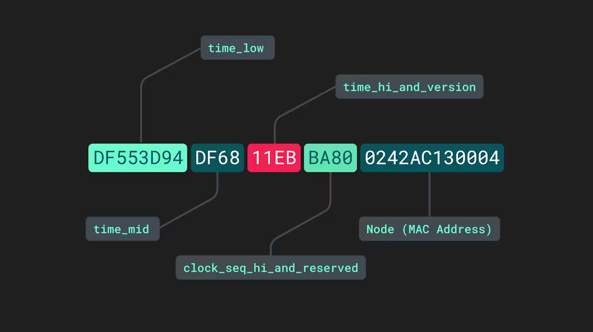

### Repository or DAO pattern

Domain Driven Design

A code to interact with persistence layer should be seperate from the business logic.

Meaning service shouldn't directly talk to db

Why? Because the persistence layer can change => SRP

DAO layer :
Data Access Objects => Objets that allow you to access data

controller -> service -> repository -> JPA -> Hibernate -> jdbc -> mySQLDriver

### UUID:
-> Every table must have a primary key
-> But the limit of int is 2 Billion -> 2 * 10^9 values
-> A table that stores for every video, which all users have seen that video -> i may get more than 2 billion easily

> Primary keys are auto-incremented with Long data type
> When we shard the Db or if Db is distributed, ensuring auto-increment across database machines in difficult - hence we may have duplicate ID's
> 
> No 2 shards should not have same Id
> keys shouldnot be easily iterable
> 

UUID - Universally Unique Identifier

\

takes a hash of a set of param to generate a unique identifier
2 famous versions of UUID to generate unique identifier
1. v7
2. v4 - id's generated are ordered by timestamp
UUID is 128 bit - binary

## Inheritance in JPA

Relational databases don't have a straight forward way to map class hierarchies in database tables

JPA provides below specifications : 
1. MappedSuperclass - parent class don't have table, only child classes have tables
2. Single Table - tables from diff child classes with common parent -all stored in a single table
3. Joined Table - Each class has a table and querying a child class requires join
4. Table per class - All properties of class are in this table

Implemented in InheritanceExamples

